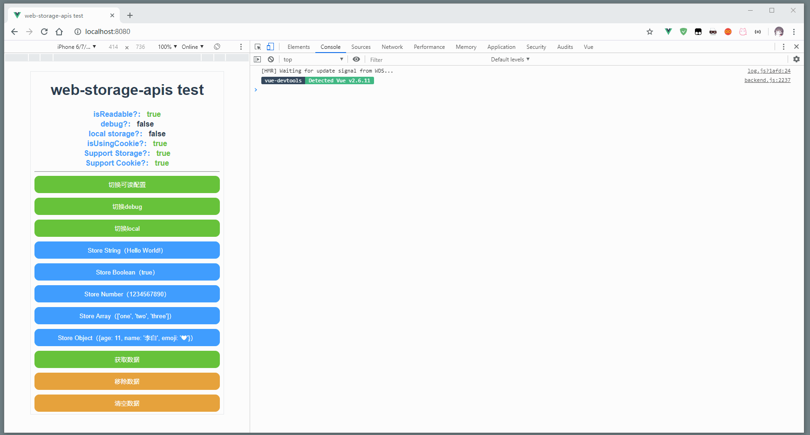

# Web-storage-apis

> Make localstorage and sessionStorage easy to use.
>
> 帮助您更好地使用本地存储


## 🔨 Usage

### Install

```bash
npm i web-storage-apis

# of yarn

yarn add web-storage-apis
```


### Import module

`app/src/main.js`

```javascript
import storage from 'web-storage-apis'
Vue.prototype.$storage = storage
```

### With vue

`app/src/App.vue`

```vue
<template>
  <div class="content">
    <div>
      <el-button type="primary" @click="storageData('data', 999)">存入数字数据</el-button>
    </div>
    <div>
      <el-button type="primary" @click="storageData('data', false)">存入布尔数据</el-button>
    </div>
    <div>
      <el-button type="success" @click="storageData('data', '我是字符串')">存入字符串数据</el-button>
    </div>
    <div>
      <el-button type="info" @click="storageData('data', [1,2,3, '123'])">存入数组数据</el-button>
    </div>
    <div>
      <el-button type="info" @click="storageData('data', {name: 'libai',age: 18})">存入对象数据</el-button>
    </div>
    <div>
      <el-button type="warning" @click="getData('data')">获取数据</el-button>
    </div>
    <div>
      <el-button type="danger" @click="removeData('data')">移除单个数据</el-button>
    </div>
    <div>
      <el-button type="danger" @click="clearData()">移除全部数据</el-button>
    </div>
  </div>
</template>

<script>
export default {
  name: 'Index',
  methods: {
    storageData(name, data) {
      console.log(`存取数据名：${name}，数据为：`, data)
      this.$storage.setStorageSync(name, data, true)
    },
    getData(name) {
      try {
        console.log(
          `获取数据名为：${name},数据为：`,
          this.$storage.getStorageSync(name, true)
        )
      } catch (error) {
        console.log(error.message)
      }
    },
    removeData(name) {
      console.log(`移除数据名为：${name}`)
      this.$storage.removeStorageSync(name, true)
    },
    clearData() {
      console.log(`清除所有数据`)
      this.$storage.clearStorageSync(true)
    }
  }
}
</script>

<style lang="scss" scoped>
.content {
  padding: 5%;
}
div {
  margin-bottom: 5px;
}
</style>

```


##  ❔ Why

> Recently, the background management project of the development company needs to persist the data, using the localStorage of H5 to save it, but the native api interface is very difficult to use, so it is encapsulated. The api style draws lessons from the data interface style of uni-app.
>
> 最近开发公司后台管理项目需要将数据持久化，利用H5的localStorage去保存但是原生的api接口非常不好用，因此对其进行了封装，api风格借鉴了uni-app的[数据接口风格](https://uniapp.dcloud.io/api/storage/storage?id=setstoragesync)


## 🔔 **Attention**

> This library is using in our company project, So you can use it with confidence.
>
> If you find any bug,please using Issues.
>
> Thanks.


## 📄 Apis

### setStorageSync(KEY,DATA[,LOCAL])

> Storing the data in the key specified in the local cache overwrites the contents of the original key, which is a synchronization interface.
>
> 将 data 存储在本地缓存中指定的 key 中，会覆盖掉原来该 key 对应的内容，这是一个同步接口。

**Usage**

| Arguments |  Type   | Required | Default | Description                                                  |
| :-------: | :-----: | :------: | :-----: | :----------------------------------------------------------- |
|    key    | String  |    Y     |         | The specified key in the local cache<br />本地缓存中的指定的 key |
|   data    |   Any   |    Y     |         | Only native types and objects that can be serialized through JSON.stringify are supported for content that needs to be stored<br />需要存储的内容，只支持原生类型、及能够通过 JSON.stringify 序列化的对象 |
|   local   | Boolean |    N     |  false  | save to localStorage ? <br />是否使用localStorage            |

```javascript
try {
    setStorageSync('storage_key', 'hello',false);
} catch (error) {
    console.log(error.message)
}
```


### getStorageSync(KEY[,LOCAL])

> Synchronizes the contents of the specified key from the local cache, which is a synchronization interface
>
> 从本地缓存中同步获取指定key对应的内容,这是一个同步接口

**Usage**

| Arguments |  Type   | Required | Default | Description                                                  |
| :-------: | :-----: | :------: | :-----: | :----------------------------------------------------------- |
|    key    | String  |    Y     |         | The specified key in the local cache<br />本地缓存中的指定的 key |
|   local   | Boolean |    N     |  false  | get data from localStorage ?<br />是否使用localStorage       |

```javascript
try {
    const value = getStorageSync('storage_key',false);
    if (value) {
        console.log(value);
    }
} catch (error) {
    console.log(error.message)
}
```


### removeStorageSync(KEY[,LOCAL])

> Synchronously removes the specified key from the local cache.
>
> 从本地缓存中同步移除指定 key。

**Usage**

| Arguments |  Type   | Required | Default | Description                                                  |
| :-------: | :-----: | :------: | :-----: | :----------------------------------------------------------- |
|    key    | String  |    Y     |         | The specified key in the local cache<br />本地缓存中的指定的 key |
|   local   | Boolean |    N     |  false  | remove data from localStorage ?<br />是否使用localStorage    |

```javascript
try {
    removeStorageSync('storage_key');
} catch (error) {
    console.log(error.message)
}
```


### clearStorageSync([LOCAL])

> Cleans up the local data cache synchronously.
>
> 同步清理本地数据缓存。

**Usage**

| Arguments |  Type   | Required | Default | Description                                              |
| :-------: | :-----: | :------: | :-----: | :------------------------------------------------------- |
|   local   | Boolean |    N     |  false  | clean data from localStorage ?<br />是否使用localStorage |

```javascript
try {
    clearStorageSync();
} catch (error) {
    console.log(error.message)
}
```


# Use exampl gif




# Changelog

- 2020/02/21 发布到npm，可以使用npm安装了，同时`browser-storage-apis`改名为`web-storage-apis`

- 2019/09/16 添加版本信息
- 2019/07/29 优化获取不到指定key的返回值为null
- 2019/07/27 Frist commit